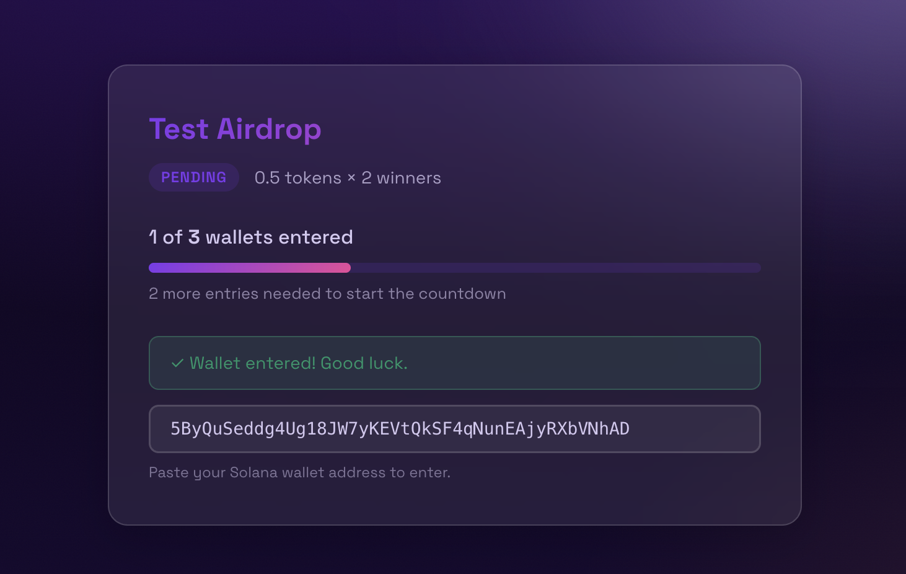

# Solana Airdrop WordPress Plugin



A WordPress plugin for running Solana SPL token giveaways. Users enter their wallet addresses; when entries hit a configurable threshold a countdown starts, wallets are checked for a minimum token holding to qualify, random winners are drawn, and tokens are sent automatically — no manual intervention required.

---

## Features

- **Wallet entry form** — clean glassmorphism card rendered via shortcode
- **Configurable threshold** — countdown starts when N wallets have entered
- **Countdown timer** — live H:M:S display with WP-Cron reliability fallback
- **Balance qualification** — checks each wallet's SPL token balance against a minimum holding requirement, both up front at entry (instant rejection with a clear message) and again at the draw (authoritative)
- **Random draw** — configurable number of winners selected by `shuffle()` / Fisher-Yates
- **Auto token send** — raw Solana transaction built and signed in PHP (no external packages)
- **On-chain confirmation** — each send is verified via `getSignatureStatuses` before being marked sent; failed/unconfirmed txs are recorded as failed
- **Sender funding check** — aborts the draw if the hot wallet lacks enough SOL to cover fees + rent, instead of attempting partial sends
- **Concurrency-safe entries** — entry caps and the countdown trigger are enforced atomically, so simultaneous submissions can't overshoot the cap or double-schedule the draw
- **Multiple campaigns** — unlimited campaigns, each with its own shortcode
- **Per-campaign styling** — color pickers with alpha support in admin; CSS custom properties
- **Max entries cap** — optional hard limit on total entries (0 = unlimited)
- **LocalStorage persistence** — returning visitors see their entered state without re-submitting
- **Admin email** — completion notification with winner list and Solscan TX links
- **Reset campaign** — one-click reset back to pending for testing
- **TX signature storage** — transaction hashes stored and linked to Solscan Explorer

---

## Requirements

- WordPress 6.0+
- PHP 8.0+ with extensions: `sodium`, `gmp`, `openssl`
- A Solana RPC endpoint (mainnet, devnet, or private RPC like Helius/QuickNode)
- A funded sender wallet (holds tokens + SOL for transaction fees)

---

## Installation

1. Download or clone this repo into `wp-content/plugins/airdrop/`
2. Activate the plugin in **Plugins → Installed Plugins**
3. Navigate to **Airdrop** in the WordPress admin menu
4. Create a campaign and add `[airdrop id="1"]` to any page or post

---

## Usage

### Creating a Campaign

Go to **Airdrop → New Campaign** and fill in:

| Field | Description |
|---|---|
| Campaign Name | Display name shown on the card |
| Token Mint Address | SPL token mint (base58) |
| Token Decimals | Decimal places (e.g. 9 for most tokens, 6 for USDC) |
| Required Holding | Minimum raw token balance to qualify |
| Prize Per Winner | Raw tokens sent to each winner |
| Number of Winners | How many winners to draw |
| Wallet Threshold | Entries needed to start the countdown |
| Countdown Duration | Seconds from threshold hit to drawing (e.g. 3600 = 1 hr) |
| Max Entries | Hard cap on entries (0 = unlimited) |
| Solana RPC Endpoint | JSON-RPC URL for on-chain reads and sends |
| Sender Wallet Public Key | Public key of the sending wallet |
| Sender Private Key | Base58 keypair — stored AES-256 encrypted |

### Shortcode

```
[airdrop id="1"]
```

Place on any page or post. Supports multiple campaigns on the same page.

### Campaign States

| State | Description |
|---|---|
| `pending` | Accepting entries; shows progress bar toward threshold |
| `countdown` | Threshold hit; shows live countdown timer |
| `distributing` | Countdown expired; qualifying and sending tokens |
| `complete` | Done; shows winner list |

---

## Security

> ⚠️ **The sender wallet is a hot wallet.** Only fund it with the tokens and SOL needed for a single airdrop. Do not use a wallet holding significant assets.

- Private keys are encrypted with AES-256-CBC using WordPress's `wp_salt('auth')` as the key
- IP-based rate limiting: one entry per IP address per campaign
- Nonce-protected AJAX endpoints
- Admin-only endpoints require `manage_options` capability

---

## How Token Sending Works

Tokens are sent via a raw Solana legacy transaction built entirely in PHP:

1. Decode the sender's base58 private key
2. Fetch the sender's Associated Token Account (ATA)
3. Derive the recipient's ATA via PDA (`findProgramAddress`)
4. If the recipient ATA doesn't exist, prepend a `createAssociatedTokenAccount` instruction
5. Build an SPL Token `transfer` instruction (9 bytes: tag `0x03` + amount as little-endian u64)
6. Serialize the transaction message (header + accounts + blockhash + instructions)
7. Sign with `sodium_crypto_sign_detached()`
8. Send via `sendTransaction` RPC call
9. Confirm on-chain via `getSignatureStatuses` (polled until confirmed/finalized or timeout) — a returned signature only means the tx was accepted into the mempool, not that it succeeded

Before any sends, the sender wallet's SOL balance is checked against the worst-case cost (transaction fees plus token-account rent for every winner). If it's underfunded, the draw is aborted and all drawn winners are marked failed rather than sending to only some.

No external Solana SDKs or Composer packages required.

---

## File Structure

```
airdrop/
├── airdrop.php                    # Bootstrap, constants, singleton, activation hook
├── includes/
│   ├── class-airdrop-db.php       # Database CRUD — campaigns + entries
│   ├── class-airdrop-admin.php    # Admin menu, campaign form, entries table
│   ├── class-airdrop-frontend.php # [airdrop] shortcode, asset enqueueing
│   ├── class-airdrop-solana.php   # Solana RPC: balance check + SPL transfer
│   ├── class-airdrop-cron.php     # WP-Cron handler: qualify → draw → send → email
│   └── class-airdrop-ajax.php     # AJAX handlers (public + admin)
├── assets/
│   ├── css/airdrop.css            # Styles: card, countdown, form, admin pickers
│   ├── js/airdrop.js              # Frontend: submit, countdown, polling, localStorage
│   └── js/airdrop-colors.js      # Admin: WP color picker + alpha slider
└── templates/
    └── airdrop-form.php           # Shortcode HTML template
```

---

## Database Tables

### `wp_airdrop_campaigns`
Stores campaign configuration and state.

### `wp_airdrop_entries`
Stores each wallet submission with qualification status and TX signature.

Tables are created on plugin activation via `dbDelta()`.

---

## WP-Cron Reliability

WP-Cron only fires on page load. If no traffic hits your site exactly when the countdown expires, the draw could be delayed. The plugin handles this two ways:

1. **Client-side fallback** — when the JS countdown hits zero, it POSTs to `airdrop_check_overdue`. If the countdown has expired but the campaign is still in `countdown` state, processing is triggered immediately.
2. **Admin manual trigger** — the Entries view has a "⚡ Force Process Now" button.

For production deployments with high reliability requirements, configure a real cron job to hit `wp-cron.php` on a schedule.

---

## Changelog

### 1.0.3
- **Entry-time holding check:** wallets below the `required_holding` minimum are now rejected at submission with an instant, decimal-formatted message (e.g. "holds 1,200 but needs at least 5,000 tokens"). Skipped when no minimum is set or the wallet is already entered. The draw still re-checks on-chain and remains authoritative; the entry check **fails open** on RPC errors so a transient outage never blocks a real holder. Adds one RPC call per qualifying submission — use a private RPC under heavy traffic.

### 1.0.2
- **Fix activation on MySQL:** removed the `DEFAULT '{}'` on the `custom_colors` `TEXT` column, which MySQL rejects (`BLOB, TEXT, GEOMETRY or JSON column ... can't have a default value`). The default is applied in PHP on insert instead. SQLite tolerated the invalid DDL, so this only surfaced on production MySQL.

### 1.0.1
- **On-chain confirmation:** transfers are now confirmed via `getSignatureStatuses` before being marked `sent`; on-chain failures and timeouts are recorded as `failed` (with the signature kept for debugging).
- **Sender SOL fee pre-check:** the draw aborts cleanly if the hot wallet can't cover fees + token-account rent for all winners, avoiding partial sends.
- **Concurrency-safe entries:** `max_entries` is enforced atomically (per-row ordinal) and the `pending → countdown` transition uses a conditional update, preventing cap overshoot and double-scheduling under simultaneous submissions.

### 1.0.0
- Initial release.

---

## License

GPL-2.0-or-later
